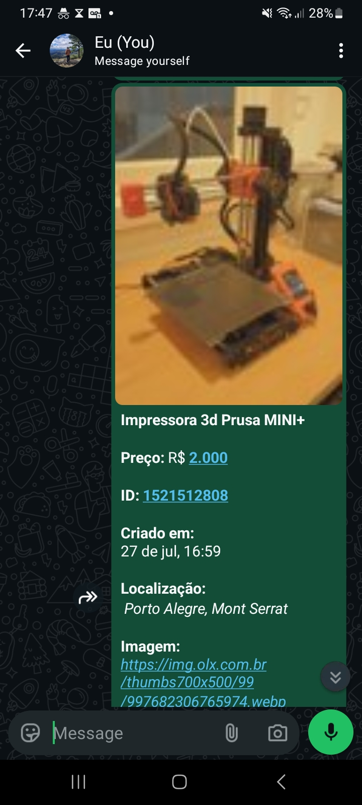

<h1 align="center">OLX Scraper - Scraper Bot with Whatsapp Integration</h1>
<p align="center">
  
  <br>
  <i>Get the most recent offers of OLX in your Whatsapp, 
    <br>with this Docker-managed Scraper Bot.</i>
  <br>
</p>

## Introduction

[](https://github.com/nothingnothings/zap-scraper)

This is a Docker-managed Web Crawler which focuses on fetching data from a single page from OLX (most recent offer postings of a given product, as seen in the target.json example).

The languages/technologies used were Python, PHP, Go, RabbitMQ and SQLite.

The script uses Selenium for the Web Scraping, PHP for the management of the data with spreadsheet files, Go for the whatsapp messaging system and SQLite for the management of the local databases where the already archived entries are stored (for avoiding duplicate messages being sent to the whatsapp numbers). The offer postings are sent to the assigned whatsapp numbers in ``targets.json`` and, at the same time, saved to a Google Sheets Spreadsheet file.

For more information on how to use it, check the instructions below and the example files provided in the project (``.env.example``, ``google-service-account.example``,``target.json`` and ``example_spreadsheet.csv``).

## Project's Directory Structure (How your project's directory must look)

```
.
├── .env
├── .env.example
├── .gitattributes
├── .gitignore
├── config
│   ├── .env
│   ├── .env.example
│   ├── google-service-account.example
│   └── olx-scraper-503818-daa5324297d3.json
├── crawl-olx
│   ├── composer.json
│   ├── config
│   │   ├── olx-scraper-503818-daa5324297d3.json
│   │   └── target.json
│   ├── CrawlDataOLX.php
│   ├── Dockerfile
│   ├── entrypoint.sh
│   ├── selenium_fetcher.py
│   └── SpreedSheet.php
├── docker-compose.yml
├── extras
│   ├── rabbitMqSendMessage.go
│   └── receiveMessagesWa.go
├── README.md
├── serviceSendTextMessage
│   ├── Dockerfile
│   ├── go.mod
│   ├── go.sum
│   ├── login.go
│   ├── main.go
│   └── send_message.go
└── whatsapp-data
```

## Installation/Usage

1. Run `git clone` to clone the project into your local Git repository.
2. Create a spreadsheet on Google Sheets. You must import the provided ``example_spreadsheet.csv`` file, which contains the necessary sheet format. After you saved the spreadsheet, check the URL, which will have this shape: [docs.google.com/spreadsheets/d/1-XXXXXXXXXXXXXXXXXXXSgGTwY/edit#gid=0](https://docs.google.com/spreadsheets/d/1-XXXXXXXXXXXXXXXXXXXSgGTwY/edit#gid=0.)
3. Copy the [1-XXXXXXXXXXXXXXXXXXXSgGTwY](https://docs.google.com/spreadsheets/d/1-XXXXXXXXXXXXXXXXXXXSgGTwY/edit#gid=0.) string, this is the spreadsheet's ID, and should be put in the``.env``files as the``SPREED_SHEET_ID=`` key's value, as seen in the ``.env.example``.
4. You need to enable the Google Sheets API in Google Developers Console. For more instructions on how to do this, refer to this tutorial: [medium.com/swlh/how-to-read-or-modify-spreadsheets-from-google-sheets-using-node-js-6f5a672bdd37#ed85](https://medium.com/swlh/how-to-read-or-modify-spreadsheets-from-google-sheets-using-node-js-6f5a672bdd37#ed85). This step will provide you with a Service Account email. Store it somewhere, as you will need it for the next steps.
5. Don't forget to give editor permission to the Service Account's email that you received on step 4, on the Google Sheets document that you created.
6. Fill the ``.env`` files with the remaining necessary values. ``MASTER_PHONE_NUMBER``is the number that will be used to send the Whatsapp messages. The same value must be put on the `TARGET_WA_MESSAGE=` key.`SPREED_SHEET_ID=` is the id that you obtained in the 3rd step. `SPREED_SHEET_AUTH` is the name of the json file that you obtained in the 4th step.
7. Run ``docker compose up -d --build`` to fetch the appropriate images and spin up the needed services/containers.
8. Once the containers are up, you need to enter the ``olx-scraper-servicewa-1`` service's container and scan the QR code that will appear on the terminal with your Whatsapp. For that, you can either use Docker's logs command, or use Docker Desktop's handy container viewer feature. Either way, once scanned, you will be logged into the ``MASTER_PHONE_NUMBER``'s Whatsapp account, and you won't need to do this step again.
9. The messages will be sent to the numbers described inside of the target.json file, in ``/crawl-olx/config/target.json``. Ensure that the file follows this format:

```JSON
[
  {
    "name": "Impressora A1 Mini",
    "target_url": "https://www.olx.com.br/informatica/perifericos-e-acessorios-de-computador/estado-rs?q=impressora%20a1%20mini",
    "target_wa": "555199999999@s.whatsapp.net"
  }
]
```

OBS: The target_url value must always be the listings page of products with the "most recent" filter applied, so you always get the offers that were last published on the platform.

If you followed all the steps correctly, you should see an output like this one, on the ``olx-scraper-servicewa-1`` service:

```
16:54:25.045 [WhatsApp INFO] Successfully authenticated
2026/07/31 16:54:25 WhatsApp connected.
Image bytes length=4892
First 20 bytes=[255 216 255 219 0 132 0 5 3 4 4 4 3 5 4 4 4 5 5 5]
2026/07/31 16:54:46 WhatsApp message ID: XXXXXXXXXXXXXXXXXXXXX
2026/07/31 16:54:46 Server timestamp: {0 63921124486 25495904}
2026/07/31 16:54:46 Image message sent to 555199999999@s.whatsapp.net
Image bytes length=2026
First 20 bytes=[255 216 255 219 0 132 0 5 3 4 4 4 3 5 4 4 4 5 5 5]
2026/07/31 16:54:52 WhatsApp message ID: XXXXXXXXXXXXXXXXXXXXX
2026/07/31 16:54:52 Server timestamp: {0 63921124492 25495904}
2026/07/31 16:54:52 Image message sent to 555199999999@s.whatsapp.net
Image bytes length=2391
First 20 bytes=[255 216 255 219 0 132 0 5 3 4 4 4 3 5 4 4 4 5 5 5]
2026/07/31 16:54:58 WhatsApp message ID: XXXXXXXXXXXXXXXXXXXXX
2026/07/31 16:54:58 Server timestamp: {0 63921124498 25495904}
2026/07/31 16:54:58 Image message sent to 555199999999@s.whatsapp.net
Image bytes length=4351
First 20 bytes=[255 216 255 219 0 132 0 5 3 4 4 4 3 5 4 4 4 5 5 5]
2026/07/31 16:55:05 WhatsApp message ID: XXXXXXXXXXXXXXXXXXXXX
2026/07/31 16:55:05 Server timestamp: {0 63921124505 25495904}
2026/07/31 16:55:05 Image message sent to 555199999999@s.whatsapp.net
Image bytes length=3488
First 20 bytes=[255 216 255 219 0 132 0 5 3 4 4 4 3 5 4 4 4 5 5 5]
2026/07/31 16:55:11 WhatsApp message ID: XXXXXXXXXXXXXXXXXXXXX
2026/07/31 16:55:11 Server timestamp: {0 63921124511 25495904}
2026/07/31 16:55:11 Image message sent to 555199999999@s.whatsapp.net
Image bytes length=2823
First 20 bytes=[255 216 255 219 0 132 0 5 3 4 4 4 3 5 4 4 4 5 5 5]
2026/07/31 16:55:17 WhatsApp message ID: XXXXXXXXXXXXXXXXXXXXX
2026/07/31 16:55:17 Server timestamp: {0 63921124517 25495904}
2026/07/31 16:55:17 Image message sent to 555199999999@s.whatsapp.net
Image bytes length=3106
First 20 bytes=[255 216 255 219 0 132 0 5 3 4 4 4 3 5 4 4 4 5 5 5]
2026/07/31 16:55:23 WhatsApp message ID: XXXXXXXXXXXXXXXXXXXXX
2026/07/31 16:55:23 Server timestamp: {0 63921124523 25495904}
2026/07/31 16:55:23 Image message sent to 555199999999@s.whatsapp.net
Image bytes length=3345
First 20 bytes=[255 216 255 219 0 132 0 5 3 4 4 4 3 5 4 4 4 5 5 5]
2026/07/31 16:55:30 WhatsApp message ID: XXXXXXXXXXXXXXXXXXXXX
2026/07/31 16:55:30 Server timestamp: {0 63921124529 25495904}
2026/07/31 16:55:30 Image message sent to 555199999999@s.whatsapp.net
Image bytes length=3130
First 20 bytes=[255 216 255 219 0 132 0 5 3 4 4 4 3 5 4 4 4 5 5 5]
2026/07/31 16:55:36 WhatsApp message ID: XXXXXXXXXXXXXXXXXXXXX
2026/07/31 16:55:36 Server timestamp: {0 63921124536 25495904}
2026/07/31 16:55:36 Image message sent to 555199999999@s.whatsapp.net
Image bytes length=3751
First 20 bytes=[255 216 255 219 0 132 0 5 3 4 4 4 3 5 4 4 4 5 5 5]
2026/07/31 16:55:42 WhatsApp message ID: XXXXXXXXXXXXXXXXXXXXX
2026/07/31 16:55:42 Server timestamp: {0 63921124542 25495904}
2026/07/31 16:55:42 Image message sent to 555199999999@s.whatsapp.net
Image bytes length=2628
First 20 bytes=[255 216 255 219 0 132 0 5 3 4 4 4 3 5 4 4 4 5 5 5]
2026/07/31 16:55:48 WhatsApp message ID: XXXXXXXXXXXXXXXXXXXXX
2026/07/31 16:55:48 Server timestamp: {0 63921124548 25495904}
2026/07/31 16:55:48 Image message sent to 555199999999@s.whatsapp.net
```


### How the Messages are Received: 



